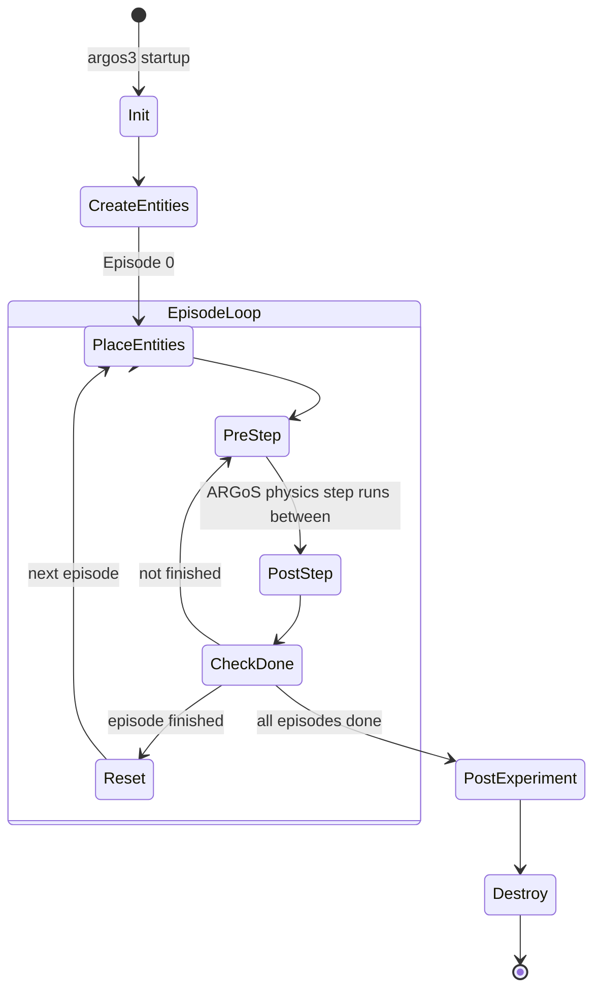
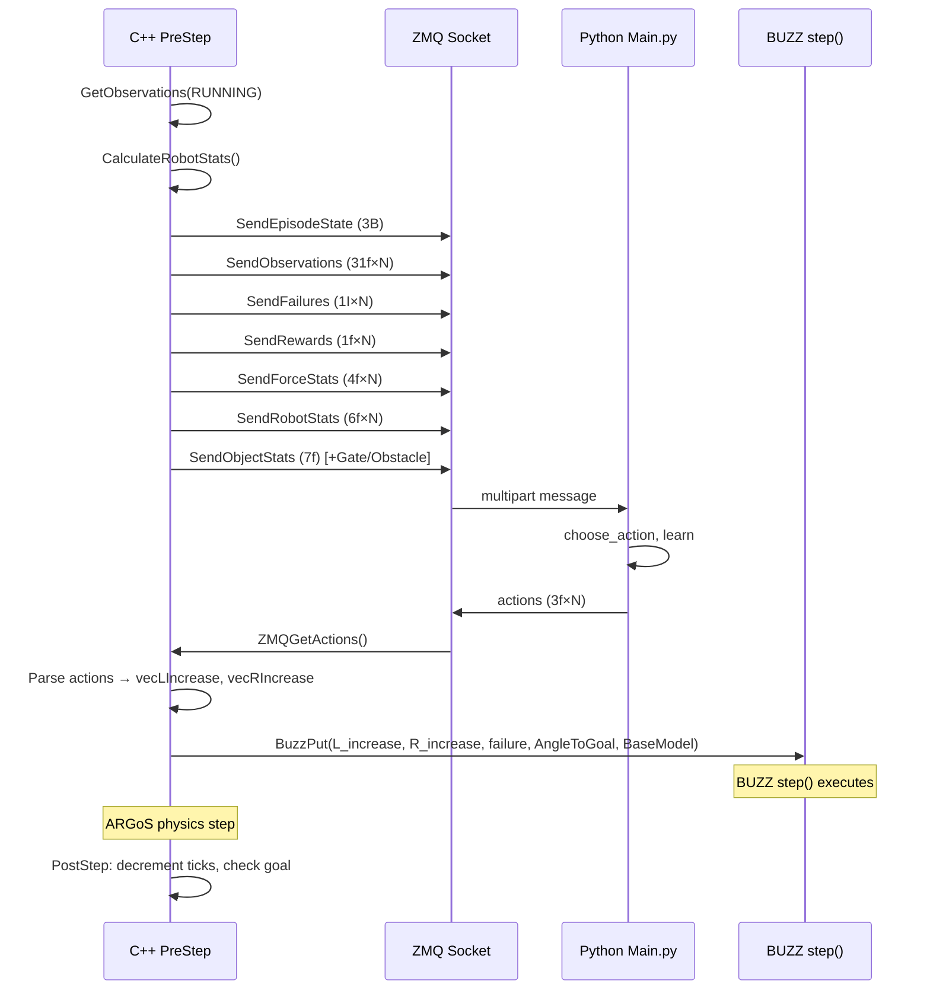

<!-- CONTEXT: Internal structure of argos/collectiveRlTransport.h/.cpp — C++ ARGoS loop functions -->
<!-- LOAD WHEN: Modifying C++ simulation code, changing observations, rewards, entity creation, or ZMQ communication -->
<!-- PREREQS: docs/architecture/TIER1_SYSTEM_DAG.md -->
<!-- RELATED: docs/protocols/ZMQ_PROTOCOL.md for message format, docs/architecture/TIER2_ARGOS_BUZZ.md for robot controller -->

# Tier 2: C++ Loop Functions (collectiveRlTransport.cpp)

## Lifecycle State Machine

## PreStep / PostStep Communication Flow

## Method Reference

### Init(TConfigurationNode& t_tree)
- FILE: collectiveRlTransport.cpp:52-147
- Parses ~20 XML attributes via GetNodeAttribute
- Creates ZMQ REQ socket, connects to Python server
- Calls ZMQSendParams() → waits for b"ok" from Python
- Allocates observation/action/reward vectors
- Calls CreateEntities() then PlaceEntities(0)
- MUST call CBuzzLoopFunctions::Init(t_tree) as last line

### CreateEntities()
- FILE: collectiveRlTransport.cpp:152-343
- MUTATES: m_pcCylinder, m_vecRobots, m_vecObstacles, m_vecGateWalls, m_vecCylinderPos, m_vecRobotPos, m_vecRobotOrient, m_vecObstaclePos, m_vecGateWallPos, m_vecGateWallSize, m_vecRobotFailures
- Creates:
  - 1 cylinder (radius m_fCylinderRadius from XML `cylinder_radius`, default 0.5m; 0.25m height, 100kg, moveable)
  - N footbots in circular arrangement (ROBOT_CYLINDER_DISTANCE=0.6m from cylinder center)
  - M obstacle cylinders (static, radius m_fObstacleRadius from XML `obstacle_radius` default 0.5m, height m_fObstacleHeight from XML `obstacle_height` default 0.5m, 100kg)
  - 2 gate walls (if use_gate=1)
- Pre-generates random positions for ALL episodes at init time
- Pre-generates robot failure schedules for all episodes
- Gate curriculum (gate_curriculum):
  - Mode 0 (off): fixed narrow gap (half-gap = gate_minimum/2) for all episodes.
  - Mode 1 (time-gated, legacy): full-width half-gap that narrows by gate_update_amount every gate_update_frequency episodes; geometry for ALL episodes is precomputed here into m_vecGateWallPos / m_vecGateWallSize / m_vecOffset.
  - Mode 2 (performance-gated): geometry is NOT precomputed. The runtime half-gap m_fGateRuntimeOffset starts at the same wide value as mode 1 and narrows only when the rolling episode success rate clears the threshold (see PostStep). Only episode-0 geometry is built here; subsequent episodes are built lazily in PostStep before each Reset.
- Per-episode gate geometry is produced by BuildGateGeometry(offset, episode), a shared helper used by both the mode-1 precompute loop and the mode-2 runtime path. The per-episode RANDOM gap y-position (m_pcRNG->Uniform) is preserved in all modes; only the OFFSET schedule differs.

### BuildGateGeometry(Real f_offset, size_t un_episode)
- Appends one episode's two gate-wall positions and sizes (and the offset) to m_vecGateWallPos / m_vecGateWallSize / m_vecOffset from a given half-gap offset. Extracted verbatim from the original mode-1 inline geometry so modes 0/1 stay bit-identical.

### ShouldAdvanceGate(window, threshold, outcomes_in_window, outcomes_observed, episodes_since_advance) [static]
- Pure decision function for the performance-gated curriculum (mode 2). Returns true iff: a full window has been observed AND at least `window` episodes have elapsed since the last advance (consolidation guard) AND (outcomes_in_window / window) >= threshold. Unit-tested in tests/integration/test_gate_curriculum_mode2.py.

### PlaceEntities(UInt32 un_episode)
- FILE: collectiveRlTransport.cpp:348-395
- Moves cylinder, robots, obstacles, gate walls to pre-generated positions for given episode
- Uses MoveEntity with ignore_collisions=true (positions are collision-free by construction)

### GetObservations(EEpisodeState e_state)
- FILE: collectiveRlTransport.cpp:519-643
- MUTATES: m_vecObs, m_vecFailures, m_vecRewards, m_vecObjStats, m_vecRobotStats, m_vecGateStats, m_vecObstacleStats
- Per-robot observation vector (31 floats):
  - [0] robot→goal distance (robot-local, rotated by -cRobotZ)
  - [1] robot→goal angle in degrees (robot-local)
  - [2] left wheel speed (from BUZZ)
  - [3] right wheel speed (from BUZZ)
  - [4] cylinder→robot distance (robot-local)
  - [5] cylinder→robot angle in degrees (robot-local)
  - [6] cylinder→goal distance (world frame, NOT rotated)
  - [7-30] 24 proximity sensor readings
- Reward calculation:
  - RUNNING: -2 + cosine_similarity(cylinder_motion, cylinder→goal_vector)
  - SUCCESS: m_fGoalReward (from config)
  - TIMEOUT: m_fTimeOutReward (from config)
- Robot failure check: compares current tick against pre-generated failure time

### CalculateRobotStats()
- FILE: collectiveRlTransport.cpp:830-858
- MUTATES: m_vecStats
- Per-robot: force magnitude, heading angle (degrees), deltaX, deltaY
- Uses differential drive kinematics: delta = (wheel_radius/2) * (L+R) * cos/sin(heading)

### PreStep()
- FILE: collectiveRlTransport.cpp:648-711
- Called BEFORE each simulation step
- Sequence: GetObservations → CalculateRobotStats → save old cylinder pos → ZMQ send all → ZMQ receive actions → BuzzPut to each robot VM
- PutIncreases struct (line 470-503): Injects L_increase, R_increase, failure, AngleToGoal, BaseModel into each BUZZ VM

### PostStep()
- FILE: collectiveRlTransport.cpp:746-798
- Called AFTER each simulation step
- Decrements tick counter, checks CylinderAtTarget
- If episode finished: sends terminal observations with SUCCESS/TIMEOUT state, waits for b"ok", increments episode counter, calls Reset
- Success/goal-reached hook: m_bReachedGoal (set from ObjectAtTarget()); consumed at `eState = m_bReachedGoal ? EPISODE_SUCCESS : EPISODE_TIMEOUT`.
- Performance-gated curriculum (gate_curriculum==2): after the ZMQ ack, pushes the finished episode's outcome (1=goal, 0=timeout) into the rolling window m_dequeGateOutcomes (capped at gate_success_window), increments m_unGateEpisodesSinceAdvance, and if ShouldAdvanceGate(...) is true narrows m_fGateRuntimeOffset by gate_update_amount (floored at gate_minimum/2), logs "Updating gap distance...", and resets the consolidation counter. The next episode's geometry is then built via BuildGateGeometry(m_fGateRuntimeOffset, m_unEpisodeCounter) so downstream indexing by m_unEpisodeCounter and m_vecGateStats emission are unchanged.

### ZMQ Send Methods
| Method | Data | Format | Flag |
|--------|------|--------|------|
| ZMQSendEpisodeState | exp_done, episode_done, reached_goal | 3 unsigned char | SNDMORE |
| ZMQSendObservations | m_vecObs | 31f × N | SNDMORE |
| ZMQSendFailures | m_vecFailures | 1I × N | SNDMORE |
| ZMQSendRewards | m_vecRewards | 1f × N | SNDMORE |
| ZMQSendForceStats | m_vecStats | 4f × N | SNDMORE |
| ZMQSendRobotStats | m_vecRobotStats | 6f × N | SNDMORE |
| ZMQSendObjectStats | m_vecObjStats | 7f | SNDMORE |
| ZMQSendObjectStatsFinal | m_vecObjStats | 7f | 0 (final) |
| ZMQSendGateStats | m_vecGateStats | 4f | 0 (final) |
| ZMQSendObstacleStats | m_vecObstacleStats | (M*2)f | 0 (final) |
| ZMQSendTermination | [1,1,0] | 3B | 0 (final, single msg) |
| ZMQSendParams | 8 params | 8f | 0 |

### Constants (top of file)
| Name | Value | Unit |
|------|-------|------|
| CYLINDER_HEIGHT | 0.25 | m |
| CYLINDER_MASS | 100 | kg |
| OBSTACLE_MASS | 100 | kg |
| FOOTBOT_RADIUS | 0.085 | m |
| ROBOT_CYLINDER_DISTANCE | 0.6 | m |
| m_fFootbotAxelLength | 0.14 | m |
| m_fFootbotWheelRadius | 0.029 | m |

### XML-configurable member vars (read in Init via GetNodeAttribute)
Geometric dimensions are XML-driven so the scale study can vary them per cell. Defaults preserve original N=4 behavior. See CONFIG_SCHEMA.md for the full attribute list.

| Member | XML attribute | Default | Unit |
|--------|---------------|---------|------|
| m_fCylinderRadius | cylinder_radius | 0.5 | m |
| m_fObstacleRadius | obstacle_radius | 0.5 | m |
| m_fObstacleHeight | obstacle_height | 0.5 | m |

## Key Member Variables (from .h)

| Variable | Type | Description |
|----------|------|-------------|
| m_cGoal | CVector2 | Goal position (x,y) from XML |
| m_fThreshold | Real | Distance to consider goal reached (decreases over training) |
| m_pcCylinder | CCylinderEntity* | The transport object |
| m_vecRobots | vector<CFootBotEntity*> | All robots |
| m_unEpisodeCounter | UInt32 | Current episode number |
| m_unEpisodeTicksLeft | unsigned int | Ticks remaining in current episode |
| m_vecRobotFailures | vector<vector<SInt32>> | Pre-generated failure times [episode][robot], -1 = no failure |
| m_cOldCylinderPos | CVector3 | Previous cylinder position for motion computation |
