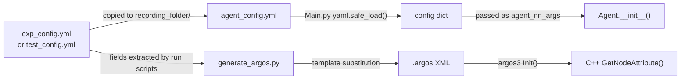

<!-- CONTEXT: Complete configuration schema for all YAML config keys and their flow through the system -->
<!-- LOAD WHEN: Modifying experiment configs, adding new config parameters, debugging config-related issues -->
<!-- PREREQS: None - standalone reference -->
<!-- RELATED: docs/protocols/ZMQ_PROTOCOL.md for how some params flow to C++ -->

# Configuration Schema

## Config Flow

## Config Keys

### Experiment-Level Keys
These appear in exp_config.yml / test_config.yml and control the overall experiment:

| Key | Type | Example | Read By | Description |
|-----|------|---------|---------|-------------|
| EXP_NAME | str | "DDPG_GSP_Neighbors_Gate_12" | run scripts | Name for the recording folder |
| NUM_EPISODES | int | 1600 | C++ Init (via XML), Main.py | Total training episodes |
| NUM_ROBOTS | int | 4 | C++ Init (via XML), Main.py (via ZMQ params) | Number of foot-bot robots |
| PORT | int | 55557 | Main.py (ZMQ bind), C++ Init (pytorch_url in XML) | ZMQ communication port |
| USE_GATE | int (0/1) | 1 | C++ Init, Main.py (via ZMQ params) | Enable gate obstacle |
| GATE_CURRICULUM | int (0/1) | 1 | C++ Init | Enable curriculum learning for gate width |
| TEST | bool | True | Main.py (--test flag) | Test mode (no learning) |
| MODEL_NUM | int | 900 | Main.py (--model_path) | Which saved model to load for testing |

### Actor Parameters
Control the RL agent architecture and action space:

| Key | Type | Default | Range | Read By | Description |
|-----|------|---------|-------|---------|-------------|
| LEARNING_SCHEME | str | "DDPG" | None, DQN, DDQN, DDPG, TD3 | Agent.__init__() via gsp_rl.Actor | RL algorithm selection. DQN/DDQN = discrete actions, DDPG/TD3 = continuous |
| OPTIONS_PER_ACTION | int | 3 | ≥2 | Agent.__init__() | For discrete: number of options per action dimension. Total actions = OPTIONS_PER_ACTION^n_actions |
| MIN_MAX_ACTION | float | 1.0 | >0 | Agent.__init__() via gsp_rl.Actor | Continuous action space bounds [-val, val] |
| META_PARAM_SIZE | int | 1 | ≥1 | Agent.__init__() via gsp_rl.Actor | Meta-parameter size for gsp_rl |
| PROX_FILTER_ANGLE_DEG | float | 60.0 | [0, 180] | Agent.filter_prox_values() | Half-angle (degrees) of arc around cylinder direction to zero out proximity readings. Sensors within this arc are filtered (set to 0) so agent focuses on obstacle detection. |

### GSP (Goal-State Prediction) Parameters
Control the auxiliary prediction task:

| Key | Type | Default | Description |
|-----|------|---------|-------------|
| GSP | bool | False | Enable GSP auxiliary task (predicts cylinder heading change) |
| RECURRENT | bool | False | Use recurrent GSP network (LSTM-based) |
| ATTENTION | bool | False | Use attention-based GSP network |
| NEIGHBORS | bool | False | GSP input includes neighbor robot states (requires circular topology) |
| GSP_INPUT_SIZE | int | 4 | Base input size for GSP network (overridden to 2+2*(n_hop*2) when NEIGHBORS=True) |
| GSP_OUTPUT_SIZE | int | 1 | GSP network output size (predicts normalized heading change) |
| GSP_MIN_MAX_ACTION | float | 1.0 | GSP action space bounds |
| GSP_LOOK_BACK | int | 2 | Number of past observations for GSP |
| GSP_SEQUENCE_LENGTH | int | 5 | Sequence length for recurrent GSP |
| RECURRENT_HIDDEN_SIZE | int | 256 | Hidden size for recurrent GSP network |
| RECURRENT_EMBEDDING_SIZE | int | 256 | Embedding size for recurrent GSP network |
| RECURRENT_NUM_LAYERS | int | 5 | Number of layers for recurrent GSP network |

### Hyperparameters
Neural network training parameters:

| Key | Type | Default | Description |
|-----|------|---------|-------------|
| GAMMA | float | 0.99997 | Discount factor |
| TAU | float | 0.005 | Soft target update rate |
| ALPHA | float | 0.001 | Actor learning rate (DDPG/TD3) |
| BETA | float | 0.002 | Critic learning rate (DDPG/TD3) |
| LR | float | 0.0001 | Learning rate (DQN/DDQN) |
| EPSILON | float | 1.0 | Initial exploration rate |
| EPS_MIN | float | 0.01 | Minimum exploration rate |
| EPS_DEC | float | 0.00005 | Epsilon decay per learn step |
| BATCH_SIZE | int | 64 | Replay buffer batch size |
| MEM_SIZE | int | 100000 | Replay buffer capacity |
| REPLACE_TARGET_COUNTER | int | 1000 | Target network update frequency (DQN/DDQN) |
| NOISE | float | 0.1 | Action noise std (DDPG/TD3) |
| UPDATE_ACTOR_ITER | int | 2 | Actor update frequency relative to critic (TD3) |
| WARMUP | int | 1000 | Steps before learning begins |
| GSP_LEARNING_FREQUENCY | int | 1000 | Steps between GSP network updates |
| GSP_BATCH_SIZE | int | 16 | GSP replay buffer batch size |

### C++ XML Attributes (set via generate_argos.py)
These are in the .argos XML file, read by C++ Init():

| Attribute | Type | Description |
|-----------|------|-------------|
| data_file | str | Output file path |
| num_robots | uint | Number of robots |
| max_robot_failures | uint | Max robots that can fail per episode |
| latest_failure_time | uint | Latest tick at which failure can occur |
| chance_failure | float | Probability a selected robot actually fails |
| goal | CVector2 | Goal (x,y) position |
| threshold | float | Distance threshold for goal reached |
| num_episodes | uint | Total episodes |
| episode_time | uint | Ticks per episode (timeout) |
| time_out_reward | float | Reward on timeout |
| threshold_freq | uint | Episodes between threshold decreases |
| threshold_dec | float | Amount to decrease threshold |
| min_threshold | float | Minimum threshold value |
| goal_reward | float | Reward on goal reached |
| pytorch_url | str | ZMQ URL (e.g., tcp://localhost:55557) |
| alphabet_size | uint | Communication alphabet size |
| proximity_range | float | Proximity sensor range (0 = default) |
| num_obstacles | uint | Number of static obstacles |
| use_gate | uint (0/1) | Enable gate obstacle |
| gate_curriculum | uint (0/1/2) | Gate curriculum mode: 0=off (fixed narrow gap), 1=time-gated (narrows every gate_update_frequency episodes), 2=performance-gated (narrows only when rolling success rate clears gate_success_threshold) |
| gate_update_frequency | uint | Episodes between gate narrowing (mode 1 only) |
| gate_update_amount | float | Gate narrowing (half-gap) per update (modes 1 and 2) |
| gate_minimum | float | Minimum gate opening width (floor = gate_minimum/2 half-gap) |
| gate_success_threshold | float | Mode 2 only. Rolling success rate (0..1) over a full window required to narrow the gate. Default 0.8 |
| gate_success_window | uint | Mode 2 only. Number of most-recent episode outcomes in the rolling success window; also the consolidation guard (min episodes between advances). Default 20 |
| use_base_model | uint (0/1) | Use hardcoded controller instead of learned |
| cylinder_radius | float | Payload cylinder radius (m). Default 0.5 |
| obstacle_radius | float | Obstacle cylinder radius (m). Default 0.5 |
| obstacle_height | float | Obstacle cylinder height (m). Default 0.5 |

## Command-Line Arguments (Main.py)

| Argument | Type | Default | Description |
|----------|------|---------|-------------|
| recording_path | str (positional) | required | Path to recording folder (must contain agent_config.yml, Data/, Models/) |
| --test | flag | False | Run in test mode (no learning, loads saved model) |
| --model_path | str | None | Path to saved model for testing |
| --trained_num_robots | int | None | Override n_agents for loading model trained with different robot count |
| --no_print | flag | False | Suppress console output |
| --independent_learning | flag | False | Each robot gets its own neural network (vs shared) |
| --global_knowledge | flag | False | Append other robots' positions+velocities to observation |
| --share_prox_values | flag | False | Robots share averaged proximity values |
